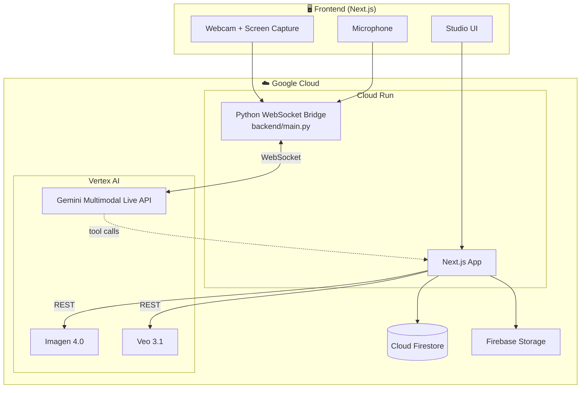

# 🦅 VantAIge: The Strategic Brand Engine

**Status**: Alpha / Active Development  
**Stack**: Next.js, Cloud Firestore, Gemini Multimodal Live via Vertex AI (WebSockets)

VantAIge is an AI-powered "Marketing Director" that combines real-time situational awareness (vision/audio) with a deep, persistent memory of brand identity (Vibe Profiles).

---

## 📋 For Judges

| Requirement | Details |
|-------------|---------|
| **🔗 Public Code Repository** | [https://github.com/dexkcd/vantaige](https://github.com/dexkcd/vantaige) |
| **🖥️ Spin-Up Instructions** | See [Quick Start](#-quick-start-spin-up-instructions) below |
| **☁️ Proof of Google Cloud Deployment** | See [GCP Proof](#-proof-of-google-cloud-deployment) below |
| **🏗️ Architecture Diagram** | See [Architecture Diagram](#-architecture-diagram) below *(Pro tip: Export or screenshot this for the submission image carousel)* |

---

## 🚀 Quick Start (Spin-Up Instructions)

Reproducible local setup for judges:

### Prerequisites
- **Node.js** 18+
- **Python** 3.10+ (3.12+ recommended)
- **gcloud CLI** ([install](https://cloud.google.com/sdk/docs/install)) — authenticated with `gcloud auth application-default login`
- **Google Cloud project** with billing enabled; APIs: `aiplatform.googleapis.com`, Firestore

### 1. Clone and install
```bash
git clone https://github.com/dexkcd/vantaige.git
cd vantaige
npm install
```

### 2. Environment
Create `.env.local` in the project root:
```bash
GOOGLE_CLOUD_PROJECT=your_gcp_project_id
GOOGLE_CLOUD_LOCATION=us-central1
NEXT_PUBLIC_WS_URL=ws://localhost:8000/ws
```

### 3. Start the WebSocket backend (Terminal 1)
```bash
cd backend
python3 -m venv .venv
source .venv/bin/activate   # Windows: .venv\Scripts\activate
pip install -r requirements.txt
uvicorn main:app --reload --host 0.0.0.0 --port 8000
```

### 4. Start the Next.js app (Terminal 2)
```bash
npm run dev
```

### 5. Open
Visit [http://localhost:3000](http://localhost:3000). Choose **New Session** or **Continue Session** (with passcode), then **Start conversation**.

---

## ☁️ Proof of Google Cloud Deployment

VantAIge runs on **Google Cloud Run** and uses multiple GCP services. Code references:

| GCP Service | Code Location | Purpose |
|-------------|---------------|---------|
| **Vertex AI (Gemini Live)** | [`backend/main.py`](backend/main.py) | WebSocket bridge to Gemini Multimodal Live API |
| **Vertex AI (Imagen, Veo)** | [`src/app/actions/memory.ts`](src/app/actions/memory.ts) | Image generation (Imagen 4.0), video generation (Veo 3.1) |
| **Cloud Firestore** | [`src/lib/firestore.ts`](src/lib/firestore.ts) | Vibe profiles, session logs, brand assets, marketing plans |
| **Firebase Storage** | [`src/lib/storage.ts`](src/lib/storage.ts) | Brand asset images, Veo video output |
| **Cloud Run** | [`scripts/deploy-cloud-run.sh`](scripts/deploy-cloud-run.sh) | Deployment script for both services |

*Optional proof: A short screen recording of the app running on GCP (e.g. Cloud Run console, logs) can be included in your submission.*

---

## 🏗️ Architecture Diagram



*Pro tip: Screenshot this diagram or export it as an image for the submission file upload / image carousel.*

---

## 🎯 Core Mission

Transition AI from a "chat box" to a proactive partner that understands physical products, digital designs, and brand DNA simultaneously.

## 🛠 Feature Roadmap & Status

### 1. 👁️ The "Live Vision" Engine
- [x] Dual-Stream Input (Webcam + Screen-Share)
- [x] Camera lens toggle (front ↔ back) with live restart
- [x] Low-Latency Compositor (1FPS Gemini Stream)
- [x] Proactive Visual Auditing (Interruption logic for brand mismatches)

### 2. 🎙️ High-Fidelity Interaction (The "Director")
- [x] True Barge-in Support (VAD-driven buffer clearing)
- [ ] Affective Intelligence (Tone detection & adaptation)
- [x] Zero-Latency Hand-off (Syncing UI assets with voice)

### 3. 🧠 Strategic Brain (Memory Layer)
- [x] **Vibe Profile**: Persistent brand DNA storage (Firestore)
- [x] Session Continuity: Recalling past decisions & palettes
- [x] Real-time Updates: `upsert_vibe_profile` mid-call
- [x] Cross-session trend analysis (Gemini analysis over session logs + roadmap)

### 4. 🎨 Real-Time Execution
- [x] **Nano Banana** Asset Gen: Image generation during live calls (Imagen 4.0 via Vertex AI)
- [x] **Short-Form Video**: TikTok/YouTube Shorts (9:16) via [Veo 3.1](https://docs.cloud.google.com/vertex-ai/generative-ai/docs/models/veo/3-1-generate)
- [ ] Launch Pack Sidebar: Pinned assets & copy for review
- [x] Strategic Grounding: Google Search integration for trends

### 5. 🔄 The "Refine" Loop (Agentic Workflow)
- [x] Kanban Bridge: Turning ideas into "Draft Plans"
- [x] Roadmap Task Detail View with modal, image/video posts, status workflow
- [x] **Session Management**: New session creates passcode; Continue session restores by passcode
- [x] **Mobile-first Studio shell**: Responsive header/actions, flexible panel heights

---

## 📚 Further Documentation

- **[PROJECT.md](PROJECT.md)** — Full technical architecture, deployment, IAM, and extension guide
- **[backend/README.md](backend/README.md)** — Python WebSocket bridge setup
- **[AGENTS.md](AGENTS.md)** — Coding standards and workflow details

---
*Last Updated: 2026-03-07*
